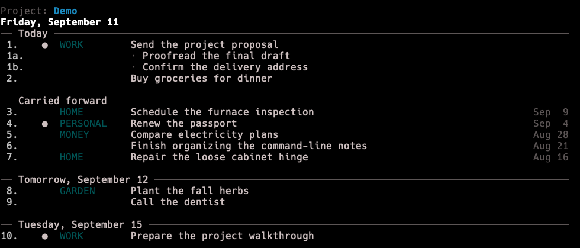
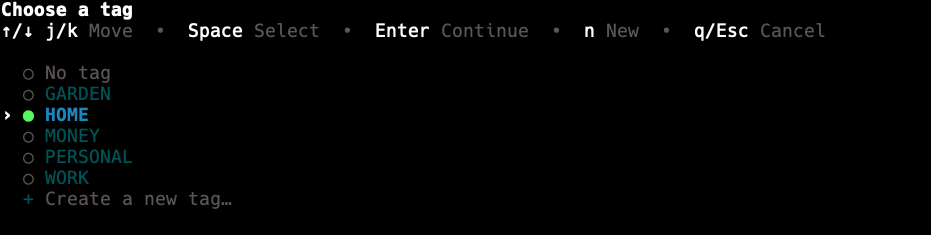
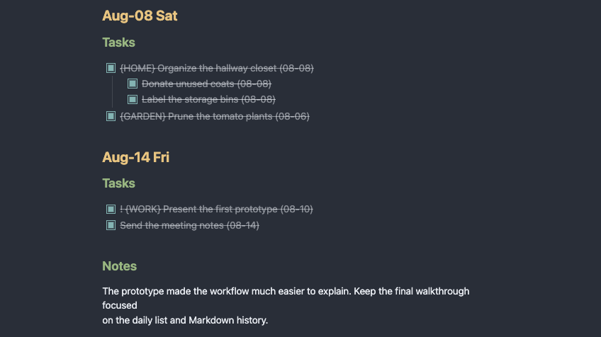
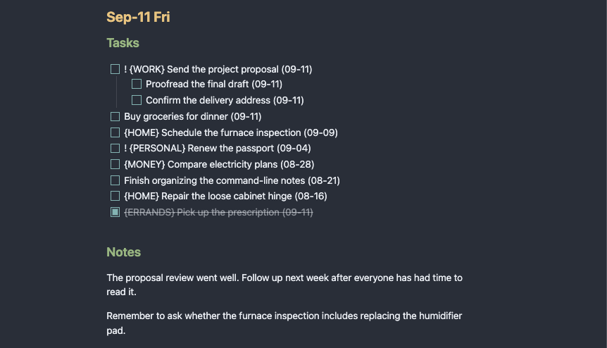

# egdo

Egdo is a local-first command-line journal for tasks and notes, stored as readable Markdown
history.

Unfinished work follows you forward. Completed work stays on the day it was finished. Each
project keeps an independent journal beside its related notes, without hiding your data in an
application database.

## Why Egdo?

- **Plain Markdown** — Read and edit the archive with Obsidian, any text editor, or ordinary
  file tools.
- **Useful history** — Completed tasks and notes remain organized by day in monthly files.
- **Rolling work** — Unfinished tasks return automatically instead of becoming stranded on
  an old list.
- **Independent projects** — Initialize a journal wherever its work belongs and let directory
  context select it.
- **Terminal-native** — Use concise commands when you know what you want or guided prompts
  when you do not.

## Installation

Egdo currently installs from a local clone. A dedicated tools environment keeps it available
from any directory without mixing it into another Python project:

```bash
python3 -m venv ~/.venvs/tools
~/.venvs/tools/bin/pip install -e /path/to/egdo-todo-cli
```

Add that environment to your shell path:

```bash
export PATH="$HOME/.venvs/tools/bin:$PATH"
```

Put the export in `~/.zshrc` or the corresponding startup file for your shell.

## Quick Start

Initialize a journal in the directory where its related notes live:

```bash
cd ~/Notes
egdo init Main
```

Then add, view, and complete your first task:

```bash
egdo add "Try egdo"
egdo
egdo done 1
```

Completing the task removes it from the active list but preserves it in the monthly Markdown
archive. Run `egdo add` or `egdo done` without further arguments when you prefer a guided
interactive flow.

## What It Looks Like



The displayed numbers are temporary handles for commands such as `done`, `edit`, `move`,
`delete`, `tag`, and `priority`. Tags, priority, nesting, creation dates, and scheduling remain
visible without turning the list into a dashboard.

Commands can also guide you through missing choices. This tag picker appears during
interactive task creation:



Behind both views is the Markdown archive. Completed work remains readable alongside notes,
while active tasks use ordinary checklist syntax:





## Core Ideas

**Markdown is the source of truth.** Each project stores tasks and notes in monthly files
containing only dates with actual content.

**Rollover keeps work visible.** Incomplete tasks move into the current day while retaining
their original creation dates; completed tasks and notes stay in history.

**Projects follow their context.** Running `egdo init NAME` creates a local marker and an
`egdo/` archive. Commands inside that directory tree select the project automatically.

**Direct and interactive use coexist.** Enter a complete command such as
`egdo move 2 tomorrow`, or omit what you do not know yet and let Egdo prompt for it.

**The archive belongs with your notes.** Egdo files work naturally inside an Obsidian vault
and remain usable without Egdo.

## Multiple Projects

Initialize another journal from the directory where it belongs:

```bash
cd ~/Notes/topics/gaming/minecraft
egdo init Minecraft
```

Egdo now selects Minecraft inside that directory tree and Main inside the broader notes tree.
Use `egdo project` to choose the global default, `-P Minecraft` for a one-command override,
or `egdo list --all-projects` for a read-only overview.

## Documentation

- [Guide](docs/guide.md) — Learn Egdo’s workflows, mental model, Markdown format, and project
  behavior.
- [Command reference](docs/command-reference.md) — Look up commands, arguments, and options.

The [example notes](example-notes) directory contains a populated, uninitialized journal you
can copy and adopt with `egdo init Demo` as a demo or playground. When finished, run
`egdo project remove Demo` before deleting the copy; removal unregisters the project but never
deletes its files.

The built-in help always reflects the version installed on your machine:

```bash
egdo --help
egdo add --help
```

## Development

```bash
python3 -m unittest discover -s tests
python3 -m compileall src
```

## License

Licensed under the [MIT License](LICENSE).
